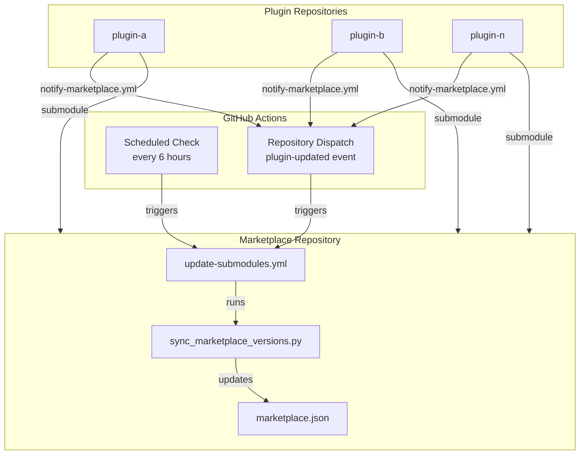

# Emasoft Plugins Marketplace

A collection of high-quality Claude Code plugins for multi-agent development workflows, skill activation, and plugin validation.

<!-- PLUGIN-VERSIONS-START -->
## Plugin Versions

| Plugin | Version | Category | Description |
|--------|---------|----------|-------------|
| perfect-skill-suggester | 1.6.1 | Utility | High-accuracy skill activation (88%+) with AI-analyzed keywords |
| claude-plugins-validation | 1.3.1 | Utility | Comprehensive validation suite for plugins, skills, hooks, and MCP |
| emasoft-assistant-manager-agent | 1.1.2 | Agent | User interface and role routing for the Emasoft agent ecosystem |
| emasoft-chief-of-staff | 1.3.2 | Agent | Multi-agent lifecycle management (spawn, monitor, hibernate, terminate) |
| emasoft-architect-agent | 1.1.2 | Agent | Architecture design, requirements analysis, and specification creation |
| emasoft-orchestrator-agent | 1.2.1 | Agent | Task distribution, agent coordination, and progress monitoring |
| emasoft-integrator-agent | 1.1.2 | Agent | Quality gates, code review, testing, and release management |
| emasoft-programmer-agent | 1.0.1 | Agent | Code implementation, testing, and debugging (Python, JS/TS, Rust, Go, .NET, C/C++, Swift) |

*Last updated: 2026-02-08*

<!-- PLUGIN-VERSIONS-END -->

---

## Installation

### Step 1: Add Marketplace

```bash
claude plugin marketplace add https://github.com/Emasoft/emasoft-plugins
```

### Step 2: Install Plugin

```bash
# Utility plugins
claude plugin install perfect-skill-suggester@emasoft-plugins
claude plugin install claude-plugins-validation@emasoft-plugins

# Emasoft agent ecosystem (install the roles you need)
claude plugin install emasoft-assistant-manager-agent@emasoft-plugins
claude plugin install emasoft-chief-of-staff@emasoft-plugins
claude plugin install emasoft-architect-agent@emasoft-plugins
claude plugin install emasoft-orchestrator-agent@emasoft-plugins
claude plugin install emasoft-integrator-agent@emasoft-plugins
claude plugin install emasoft-programmer-agent@emasoft-plugins
```

### Step 3: Verify Installation

```bash
claude plugin list
```

### Step 4: Restart Claude Code

**Important:** After installation, you must restart Claude Code for the plugin to take effect.

---

## Update to Latest Version

When a new version is released, follow these steps:

### Step 1: Update Marketplace Cache

```bash
claude plugin marketplace update emasoft-plugins
```

### Step 2: Uninstall Current Version

```bash
claude plugin uninstall perfect-skill-suggester
```

### Step 3: Install Latest Version

```bash
claude plugin install perfect-skill-suggester@emasoft-plugins
```

### Step 4: Restart Claude Code

Restart Claude Code to load the updated plugin.

---

## Reinstall (Fix Broken Installation)

If the plugin is not working correctly, perform a clean reinstall:

### Step 1: Uninstall

```bash
claude plugin uninstall perfect-skill-suggester
```

### Step 2: Update Marketplace Cache

```bash
claude plugin marketplace update emasoft-plugins
```

### Step 3: Reinstall

```bash
claude plugin install perfect-skill-suggester@emasoft-plugins
```

### Step 4: Restart Claude Code

Restart Claude Code to load the freshly installed plugin.

---

## Uninstall

To completely remove the plugin:

### Step 1: Uninstall Plugin

```bash
claude plugin uninstall perfect-skill-suggester
```

### Step 2: (Optional) Remove Marketplace

If you no longer want plugins from this marketplace:

```bash
claude plugin marketplace remove emasoft-plugins
```

### Step 3: Restart Claude Code

Restart Claude Code to complete the removal.

---

## Troubleshooting

### Commands not found after installation

**Symptom:** Plugin shows as installed and enabled, but `/pss-reindex-skills` or `/pss-status` commands are not found.

**Solution:** Restart Claude Code. Plugins only load their commands on startup.

### Plugin install fails

**Symptom:** `claude plugin install` returns an error.

**Solutions:**
1. Update the marketplace cache first:
   ```bash
   claude plugin marketplace update emasoft-plugins
   ```
2. Try reinstalling the marketplace:
   ```bash
   claude plugin marketplace remove emasoft-plugins
   claude plugin marketplace add https://github.com/Emasoft/emasoft-plugins
   ```

### Plugin shows as disabled

**Symptom:** Plugin is installed but status shows `✘ disabled`.

**Solution:** Enable the plugin:
```bash
claude plugin enable perfect-skill-suggester
```

### Hook not triggering

**Symptom:** Plugin is installed and enabled, but skill suggestions don't appear.

**Solutions:**
1. Verify the plugin is enabled: `claude plugin list`
2. Check hooks are registered: `/hooks` (inside Claude Code)
3. Restart Claude Code

### Hook path not found after version update

**Symptom:** After updating a plugin, you see an error like:
```
UserPromptSubmit operation blocked by hook:
can't open file '.../perfect-skill-suggester/1.2.1/scripts/pss_hook.py': No such file or directory
```

**Cause:** Claude Code is still referencing the OLD version path in memory. The cache now has the new version (e.g., `1.2.2/`), but the running session has the old path (`1.2.1/`) cached.

**Solution:** **Restart Claude Code** after any plugin update. This is required for Claude Code to reload the new version paths.

If restarting doesn't fix it, perform a clean reinstall:
```bash
# 1. Clear the marketplace cache
rm -rf ~/.claude/plugins/cache/emasoft-plugins/

# 2. Uninstall the plugin
claude plugin uninstall perfect-skill-suggester@emasoft-plugins

# 3. Reinstall
claude plugin install perfect-skill-suggester@emasoft-plugins

# 4. Restart Claude Code
```

### Old version still showing after update

**Symptom:** After running `claude plugin marketplace update`, the plugin still shows the old version.

**Cause:** The marketplace cache or installed plugin cache is stale.

**Solution:** Full reinstall cycle:
```bash
# 1. Clear marketplace cache
rm -rf ~/.claude/plugins/cache/emasoft-plugins/

# 2. Uninstall
claude plugin uninstall perfect-skill-suggester@emasoft-plugins

# 3. Reinstall
claude plugin install perfect-skill-suggester@emasoft-plugins

# 4. Verify version
claude plugin list | grep perfect-skill

# 5. IMPORTANT: Restart Claude Code
```

### No skill suggestions appear (silent failure)

**Symptom:** Plugin is installed and working, but no skills are ever suggested, even for prompts that should match.

**Cause:** The skill index file doesn't exist at `~/.claude/cache/skill-index.json`.

**Solution:** Run `/pss-reindex-skills` to generate the skill index. This must be done after installation.

### "Failed to read skill index" error

**Symptom:** Error message mentioning "Failed to read skill index from <path>".

**Causes:**
- File permissions issue
- Disk full
- File corrupted

**Solutions:**
1. Check file exists: `ls -la ~/.claude/cache/skill-index.json`
2. Check permissions: `chmod 644 ~/.claude/cache/skill-index.json`
3. Regenerate index: `/pss-reindex-skills`

### "Failed to parse skill index" error

**Symptom:** Error message mentioning "Failed to parse skill index".

**Cause:** The skill index JSON file is corrupted or malformed.

**Solution:** Regenerate the index (it will overwrite the corrupted file):
```
/pss-reindex-skills
```

---

## Available Plugins

### [Perfect Skill Suggester (PSS)](./perfect-skill-suggester/README.md)

> **[Full Documentation](./perfect-skill-suggester/README.md)** | **[Architecture](./perfect-skill-suggester/docs/PSS-ARCHITECTURE.md)** | **[Changelog](./perfect-skill-suggester/CHANGELOG.md)**

High-accuracy skill activation with AI-analyzed keywords and Rust-powered matching.

**Features:**
- 88%+ accuracy on skill activation
- AI-analyzed keywords via Haiku agents
- Rust binary for ~10ms hook execution
- 70+ synonym expansion patterns
- Weighted scoring system
- Three-tier confidence routing (HIGH/MEDIUM/LOW)
- Co-usage boosting for related skills
- Multi-project skill discovery from `~/.claude.json`

**Commands:**
- `/pss-status` - View PSS status and index statistics
- `/pss-reindex-skills` - Regenerate skill index with AI analysis

**Requirements:**
- Pre-built binaries included for all platforms (macOS, Linux, Windows)
- Python 3.8+ for index generation

**Supported Platforms:**

| Platform | Binary |
|----------|--------|
| macOS Apple Silicon | `pss-darwin-arm64` |
| macOS Intel | `pss-darwin-x86_64` |
| Linux x86_64 | `pss-linux-x86_64` |
| Linux ARM64 | `pss-linux-arm64` |
| Windows x86_64 | `pss-windows-x86_64.exe` |

---

### [Claude Plugins Validation](./claude-plugins-validation/README.md)

> **[Full Documentation](./claude-plugins-validation/README.md)** | **[Skill Reference](./claude-plugins-validation/skills/plugin-validation-skill/SKILL.md)**

Comprehensive validation suite for Claude Code plugins, marketplaces, hooks, skills, and MCP servers.

**Features:**
- 5 specialized Python validators (plugin, skill, hook, MCP, marketplace)
- Expert `plugin-validator` agent for thorough examination
- Complete skill with 5 reference documents
- GitHub marketplace deployment validation
- Links to 45+ official Anthropic documentation URLs
- **Multi-language linter auto-installation** (8 languages supported)
- **Multi-language dependency verification**

**Supported Languages:**
| Language | Linters |
|----------|---------|
| Python | ruff, mypy |
| JavaScript/TypeScript | eslint, typescript |
| Rust | clippy, rustfmt |
| Go | staticcheck, golangci-lint |
| Shell/Bash | shellcheck |
| PowerShell | PSScriptAnalyzer |
| Ruby | rubocop |

**Validators:**
- `validate_plugin.py` - Full plugin structure validation
- `validate_skill.py` - Skill directory and frontmatter validation
- `validate_hook.py` - Hook configuration and script validation
- `validate_mcp.py` - MCP server configuration validation
- `validate_marketplace.py` - Marketplace and GitHub deployment validation

**Usage:**
```bash
# Validate a plugin
cd OUTPUT_SKILLS/claude-plugins-validation
uv run python scripts/validate_plugin.py /path/to/your-plugin --verbose

# Validate a marketplace for GitHub deployment
uv run python scripts/validate_marketplace.py /path/to/marketplace --verbose

# From any other plugin directory (without pyproject.toml):
uv run --with pyyaml python scripts/validate_plugin.py . --verbose
```

**Exit Codes:**
| Code | Meaning |
|------|---------|
| 0 | All checks passed |
| 1 | Critical issues - plugin broken |
| 2 | Major issues - some features may fail |
| 3 | Minor issues - warnings only |

---

### Emasoft Agent Ecosystem

The six `emasoft-*` plugins form a complete multi-agent development team. Each plugin defines a role boundary and communicates with other roles via AI Maestro messaging.

```
USER
  │
  ▼
EAMA (Assistant Manager) ── User interface, role routing
  │
  ▼
ECOS (Chief of Staff) ── Agent lifecycle, coordination
  │
  ├── EAA (Architect) ── Design docs, planning
  ├── EOA (Orchestrator) ── Task distribution, delegation
  └── EIA (Integrator) ── Code review, quality gates
                │
                ▼
        EPA (Programmer) ── Code implementation
```

| Plugin | Role | Agents | Skills |
|--------|------|--------|--------|
| [emasoft-assistant-manager-agent](./emasoft-assistant-manager-agent/) | User interface, role routing | 2 | 8 |
| [emasoft-chief-of-staff](./emasoft-chief-of-staff/) | Agent lifecycle management | 10 | 14 |
| [emasoft-architect-agent](./emasoft-architect-agent/) | Architecture design, planning | 6 | 13 |
| [emasoft-orchestrator-agent](./emasoft-orchestrator-agent/) | Task distribution, coordination | 6 | 15 |
| [emasoft-integrator-agent](./emasoft-integrator-agent/) | Code review, quality gates | 11 | 19 |
| [emasoft-programmer-agent](./emasoft-programmer-agent/) | Code implementation, testing | 1 | 5 |

**Key design principles:**
- **One plugin per agent instance** — each agent loads ONLY its own plugin
- **Inter-agent communication** via AI Maestro messaging (not skill sharing)
- **Role boundaries** enforced by plugin mutual exclusivity

---

## For Developers

This section is for contributors who want to develop or modify the plugins.

### Clone the Repository

**Important:** Use `--recursive` to also fetch plugin submodules:

```bash
git clone --recursive https://github.com/Emasoft/emasoft-plugins.git
cd emasoft-plugins
```

If you already cloned without `--recursive`, initialize submodules:

```bash
git submodule update --init --recursive
```

### Setup Git Hooks

After cloning, set up git-cliff changelog generation and version sync hooks:

```bash
./scripts/setup-hooks.sh
```

This installs the following hooks:

| Repository | Hook | Purpose |
|------------|------|---------|
| Main marketplace | `pre-commit` | Syncs plugin versions from submodules to marketplace.json |
| Main marketplace | `post-commit` | Regenerates CHANGELOG.md with git-cliff |
| Each submodule | `post-commit` | Regenerates CHANGELOG.md with git-cliff |

**Requirements:** Install [git-cliff](https://git-cliff.org/) for changelog generation:

```bash
# macOS
brew install git-cliff

# Or via cargo
cargo install git-cliff
```

### Version Sync

When you bump a plugin's version in its submodule, the pre-commit hook automatically updates marketplace.json. The version is read from (in order of priority):
1. `.claude-plugin/plugin.json`
2. `pyproject.toml`
3. `package.json`

You can also run the sync manually:

```bash
# Check for version mismatches
python scripts/sync-versions.py --check --verbose

# Update marketplace.json with submodule versions
python scripts/sync-versions.py --verbose
```

### Local Testing

```bash
# Validate the marketplace
claude plugin validate .

# Validate a specific plugin
claude plugin validate ./perfect-skill-suggester

# Load plugin locally without installing
claude --plugin-dir ./perfect-skill-suggester
```

### Adding a Local Marketplace

For development, you can add the cloned repo as a local marketplace:

```bash
claude plugin marketplace add /path/to/emasoft-plugins
```

### Releasing New Versions

Use the release script for proper version bumping and tagging:

```bash
python release.py patch perfect-skill-suggester "Bug fix description"
python release.py minor perfect-skill-suggester "New feature"
python release.py major perfect-skill-suggester "Breaking change"
```

---

## License

MIT License - See individual plugin directories for specific licenses.

## Author

**Emasoft**
- GitHub: [@Emasoft](https://github.com/Emasoft)
- Email: 713559+Emasoft@users.noreply.github.com


## Architecture



### How It Works

1. **Plugin Update**: When a plugin repo pushes changes, its `notify-marketplace.yml` workflow sends a repository dispatch event
2. **Marketplace Update**: The marketplace's `update-submodules.yml` workflow triggers (via dispatch or scheduled cron)
3. **Version Sync**: The `sync_marketplace_versions.py` script reads each plugin's version and updates `marketplace.json`
4. **Auto Commit**: Changes are committed and pushed automatically

